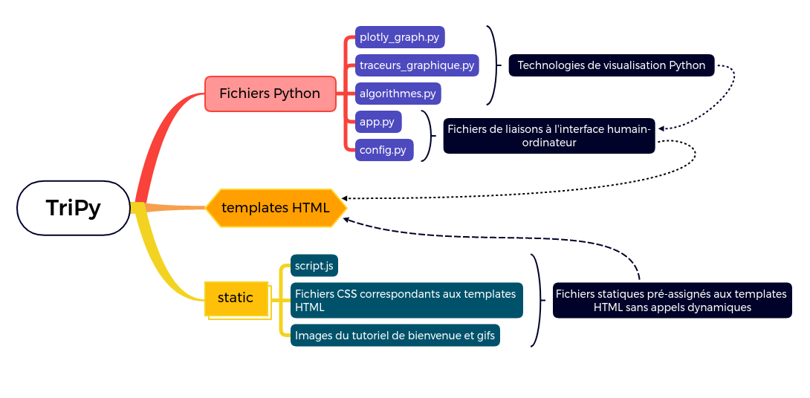
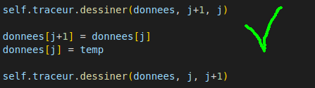
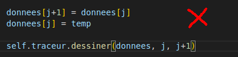

# Documentation de TriPy

## Carte mentale pour comprendre le lien qu'ont les fichiers entre eux et comment ils fonctionnent

## Explication de la carte mentale

### Fichiers de liaisons entre les technologies de visualisation Python et l'interface humain-ordinateur
    
**app.py** : Ce fichier importe les technologies de visualisation Matplotlib et Plotly de TriPy qui sont utilisées pour générer les visualisations et les résultats. C'est le code principal de l'application. Il utilise le framework Flask pour gérer les routes et les vues de l'application et renvoyer le tout aux templates HTML avec les bonnes données.

**config.py** : Ce fichier contient les variables globales qu'on souhaite conserver entre les différentes routes du fichier *app.py*. Ce fichier est réinitialisé à l'appel de la fonction *reset_global_variables()*.

### Technologies de visualisation Python

**algorithmes.py** : Ce fichier implémente les 12 algorithmes visualisables sur TriPy. Chaque algorithme a sa propre classe qui grâce aux classes de *traceurs_graphique.py* génère des visualisations.

**traceurs_graphique.py** : Ce fichier utilise la bibliothèque Matplotlib pour créer des graphiques en 2D et 3D à partir des données fournies par les algorithmes. Les graphiques créés avec cette bibliothèque sont ensuite utilisés pour créer des animations à l'aide de la bibliothèque Celluloid. Ainsi les vidéos sont converties en HTML et envoyées grâce à *app.py* sous forme de template Jinja aux fichiers HTML de manière dynamique.

Pour prendre correctement en main les classes du fichier *algorithmes.py*, veillez à appeler au bon moment *self.traceur.dessiner(donnees, premiere_highlight, deuxieme_highlight)*. Il faut que ces appels soient effectués de manière à représenter fidèlement le tri des données. Si vous appelez *self.traceur.dessiner(donnees, premiere_highlight, deuxieme_highlight)* après avoir modifié les données, la première image de la visualisation Celluloid donnera sur des données déjà modifiées. Voici des exemples de code pour rendre ça plus clair :

**plotly_graph.py** : Ce fichier utilise la bibliothèque Plotly. Il prend en entrée une liste de nombres et renvoie le temps d'exécution des 12 algorithmes disponibles sur TriPy. Chacun des 12 algorithmes a son propre code dans le fichier, indépendant de celui de *algorithmes.py* qui est reservé à la visualisation et la création d'une vidéo avec *traceurs_graphique.py*.

### Dossiers Web pour l'interface humain-ordinateur

**templates** : Ce dossier contient les fichiers HTML qui définissent les vues de l'application qu'on retrouve dans *app.py*. Les fichiers HTML contiennent des balises Jinja pour inclure des éléments dynamiques tels que des graphiques Matplotlib et des résultats d'algorithmes.

Voici un exemple de template HTML avec l'utilisation de Jinja2 en vert et les élements correspondants imagés :

**static** : Ce dossier contient des fichiers statiques tels que des fichiers CSS et des images utilisées pour personnaliser l'apparence de l'application.

---

Notez que les Fichiers Python du projet sont **commentés dans le code source**. Seul le fonctionnement des algorithmes des classes de *algorithmes.py* n'est pas décrit car c'est déjà fait dans *plotly_graph.py*.

    